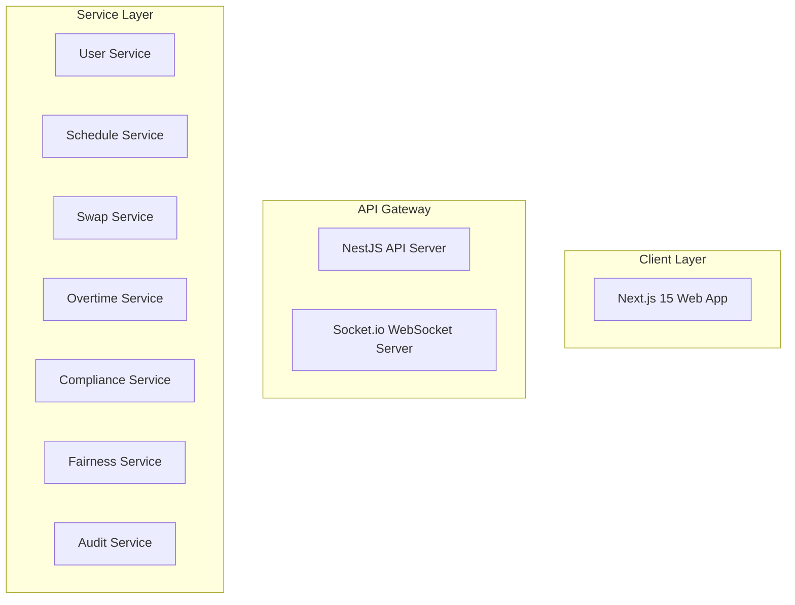

# Design Document: ShiftSync Platform

## Overview

ShiftSync is a distributed, multi-location staff scheduling platform built to handle complex scheduling constraints across multiple time zones. The system provides real-time schedule management, automated constraint validation, shift swap workflows, overtime tracking, and fairness analytics for restaurant groups.

The platform follows a modern three-tier architecture:

- **Frontend**: Next.js 15 with React Server Components and real-time updates
- **Backend**: NestJS with modular service architecture
- **Data Layer**: PostgreSQL for persistent storage, Redis for caching and distributed locking

Key architectural principles:

- **Event-driven architecture** for real-time updates using Socket.io
- **Distributed locking** with Redlock for concurrent operation safety
- **Background job processing** with BullMQ for time-intensive operations
- **Multi-timezone support** with explicit timezone context throughout the system
- **Constraint validation engine** for enforcing business rules and labor law compliance

## Architecture

### System Components



    subgraph "Infrastructure Layer"
        ConflictDetector[Conflict Detector]
        LockManager[Distributed Lock Manager]
        JobQueue[BullMQ Job Queue]
        CacheManager[Cache Manager]
    end

    subgraph "Data Layer"
        PostgreSQL[(PostgreSQL + Prisma)]
        Redis[(Redis)]
    end

    WebApp -->|HTTP/REST| NestJS
    WebApp -->|WebSocket| WS
    NestJS --> UserSvc
    NestJS --> ScheduleSvc
    NestJS --> SwapSvc
    NestJS --> OvertimeSvc
    NestJS --> ComplianceSvc
    NestJS --> FairnessSvc
    NestJS --> AuditSvc

    ScheduleSvc --> ConflictDetector
    ScheduleSvc --> ComplianceSvc
    SwapSvc --> ConflictDetector
    ConflictDetector --> LockManager

    FairnessSvc --> JobQueue
    OvertimeSvc --> JobQueue

    UserSvc --> PostgreSQL
    ScheduleSvc --> PostgreSQL
    SwapSvc --> PostgreSQL
    OvertimeSvc --> PostgreSQL
    AuditSvc --> PostgreSQL

    LockManager --> Redis
    CacheManager --> Redis
    JobQueue --> Redis

    WS -.->|Broadcasts| WebApp

```

```

### Technology Stack

**Frontend:**

- Next.js 15 with App Router
- React Server Components for initial page loads
- Socket.io client for real-time updates
- TanStack Query (v5) for server state management
- TanStack Table for complex data tables with sorting/filtering
- Tailwind CSS for styling
- Shadcn UI for component library
- Sonner for toast notifications
- Lucide React for iconography

**Backend:**

- NestJS framework with TypeScript
- Prisma ORM for database access
- Socket.io for WebSocket communication
- Passport.js with JWT strategy for authentication
- BullMQ for background job processing
- BullBoard for job queue visualization
- Redlock for distributed locking
- Swagger/Scalar for API documentation
- Pino for structured logging
- Argon2 for password hashing

**Data Storage:**

- PostgreSQL 15+ (Neon DB) for relational data
- Redis 7+ (Redis Cloud) for caching, distributed locks, and job queues

**Infrastructure & Tooling:**

- Turborepo for monorepo management
- Docker for containerization
- Node.js 20+ runtime
- Zod for shared validation schemas
- Vitest for unit and property-based testing
- Playwright for E2E testing
- fast-check for property-based testing

### Communication Patterns

1. **Synchronous REST API**: Standard CRUD operations, authentication, queries
2. **WebSocket (Socket.io)**: Real-time updates for schedule changes, conflict notifications, job completion
3. **Background Jobs**: Long-running analytics, bulk operations, scheduled tasks
4. **Database Transactions**: Atomic operations for critical state changes
5. **Distributed Locks**: Serialization of concurrent operations on shared resources

## Components and Interfaces

### User Service

Manages user accounts, authentication, roles, skills, and location certifications.

**Responsibilities:**

- User CRUD operations
- Role-based access control (RBAC)
- Skill and certification management
- Password hashing and verification
- JWT token generation and validation

**Key Methods:**

```typescript
interface UserService {
  createUser(data: CreateUserDto): Promise<User>;
  assignRole(userId: string, role: Role, locationIds?: string[]): Promise<User>;
  addSkill(userId: string, skillId: string): Promise<void>;
  addLocationCertification(userId: string, locationId: string): Promise<void>;
  authenticate(
    email: string,
    password: string,
  ): Promise<{ token: string; user: User }>;
  validateToken(token: string): Promise<User>;
  getUsersByLocation(locationId: string): Promise<User[]>;
}
```

### Schedule Service

Handles shift creation, assignment, and validation with constraint checking.

**Responsibilities:**

- Shift CRUD operations
- Staff assignment to shifts
- Multi-timezone shift display
- Overnight shift handling
- Integration with Conflict Detector and Compliance Monitor

**Key Methods:**

```typescript
interface ScheduleService {
  createShift(data: CreateShiftDto, managerId: string): Promise<Shift>;
  assignStaff(
    shiftId: string,
    staffId: string,
    managerId: string,
  ): Promise<Assignment>;
  unassignStaff(assignmentId: string, managerId: string): Promise<void>;
  getSchedule(
    locationId: string,
    startDate: Date,
    endDate: Date,
    timezone: string,
  ): Promise<Shift[]>;
  getStaffSchedule(
    staffId: string,
    startDate: Date,
    endDate: Date,
  ): Promise<Shift[]>;
}
```

### Conflict Detector

Prevents double-booking and manages concurrent scheduling operations.

**Responsibilities:**

- Overlap detection across all locations
- Distributed locking for concurrent operations
- UTC conversion for cross-timezone comparison
- Conflict notification via WebSocket

**Key Methods:**

```typescript
interface ConflictDetector {
  checkOverlap(
    staffId: string,
    shiftStart: Date,
    shiftEnd: Date,
    excludeShiftId?: string,
  ): Promise<Shift | null>;
  acquireLock(staffId: string, timeoutMs: number): Promise<Lock>;
  releaseLock(lock: Lock): Promise<void>;
  withLock<T>(staffId: string, operation: () => Promise<T>): Promise<T>;
}
```

**Locking Strategy:**

- Use Redlock algorithm with Redis for distributed locks
- Lock key format: `lock:staff:{staffId}`
- Default lock timeout: 5 seconds
- Automatic lock expiration to prevent deadlocks
- Retry logic with exponential backoff (max 3 attempts)

### Compliance Monitor

Enforces labor law requirements and business constraints.

**Responsibilities:**

- Rest period validation (10-hour minimum)
- Daily hour limit enforcement
- Weekly hour limit enforcement (40 hours)
- Consecutive days limit enforcement
- Per-location configuration support

**Key Methods:**

```typescript
interface ComplianceMonitor {
  validateRestPeriod(
    staffId: string,
    newShiftStart: Date,
    newShiftEnd: Date,
  ): Promise<ValidationResult>;
  validateDailyLimit(
    staffId: string,
    shiftStart: Date,
    shiftEnd: Date,
    locationId: string,
  ): Promise<ValidationResult>;
  validateWeeklyLimit(
    staffId: string,
    shiftStart: Date,
    shiftEnd: Date,
    locationId: string,
  ): Promise<ValidationResult>;
  validateConsecutiveDays(
    staffId: string,
    shiftDate: Date,
    locationId: string,
  ): Promise<ValidationResult>;
  validateAll(staffId: string, shift: ShiftData): Promise<ValidationResult[]>;
}
```

### Swap Workflow Manager

Manages shift swap requests and approval workflows.

**Responsibilities:**

- Swap request creation and validation
- Manager approval/rejection workflow
- Atomic assignment updates
- Notification to involved parties

**Key Methods:**

```typescript
interface SwapService {
  createSwapRequest(
    requestorId: string,
    shiftId: string,
    targetStaffId: string,
  ): Promise<SwapRequest>;
  approveSwap(swapRequestId: string, managerId: string): Promise<void>;
  rejectSwap(
    swapRequestId: string,
    managerId: string,
    reason: string,
  ): Promise<void>;
  getPendingSwaps(managerId: string): Promise<SwapRequest[]>;
  getSwapsByStaff(staffId: string): Promise<SwapRequest[]>;
}
```

### Overtime Tracker

Calculates and tracks overtime hours for staff members.

**Responsibilities:**

- Rolling 7-day hour calculation
- Overtime flagging (hours > 40)
- Weekly reports generation
- Overtime warnings for new assignments

**Key Methods:**

```typescript
interface OvertimeService {
  calculateHours(
    staffId: string,
    startDate: Date,
    endDate: Date,
  ): Promise<HoursSummary>;
  getOvertimeReport(
    locationId: string,
    weekStart: Date,
  ): Promise<OvertimeReport[]>;
  checkOvertimeWarning(
    staffId: string,
    newShift: ShiftData,
  ): Promise<OvertimeWarning | null>;
  generatePayPeriodReport(startDate: Date, endDate: Date): Promise<void>; // Background job
}
```

### Fairness Analyzer

Calculates and reports on equitable shift distribution.

**Responsibilities:**

- Hour distribution statistics
- Premium shift tracking
- Deviation identification
- Visual analytics generation (background job)

**Key Methods:**

```typescript
interface FairnessService {
  calculateHourDistribution(
    locationId: string,
    startDate: Date,
    endDate: Date,
  ): Promise<HourDistribution>;
  calculatePremiumShiftDistribution(
    locationId: string,
    startDate: Date,
    endDate: Date,
  ): Promise<PremiumShiftDistribution>;
  identifyOutliers(distribution: HourDistribution): Promise<StaffOutlier[]>;
  generateFairnessReport(
    locationId: string,
    startDate: Date,
    endDate: Date,
  ): Promise<void>; // Background job
}
```

### Audit Logger

Records all system changes with immutable audit trail.

**Responsibilities:**

- Append-only audit record storage
- Cryptographic hash generation for integrity
- Searchable audit query interface
- Audit record verification

**Key Methods:**

```typescript
interface AuditService {
  logShiftChange(
    action: AuditAction,
    shiftId: string,
    userId: string,
    changes: any,
  ): Promise<void>;
  logAssignmentChange(
    action: AuditAction,
    assignmentId: string,
    userId: string,
    changes: any,
  ): Promise<void>;
  logSwapAction(
    action: AuditAction,
    swapRequestId: string,
    userId: string,
    decision?: string,
  ): Promise<void>;
  logUserChange(
    action: AuditAction,
    targetUserId: string,
    actorUserId: string,
    changes: any,
  ): Promise<void>;
  queryAuditLog(filters: AuditQueryFilters): Promise<AuditRecord[]>;
  verifyIntegrity(recordId: string): Promise<boolean>;
}
```

### Real-Time Sync Service

Manages WebSocket connections and broadcasts updates.

**Responsibilities:**

- WebSocket connection management
- Room-based subscriptions (by location, user)
- Event broadcasting for schedule changes
- Connection cleanup on disconnect

**Key Events:**

```typescript
// Server -> Client events
interface ServerEvents {
  "shift:created": (shift: Shift) => void;
  "shift:updated": (shift: Shift) => void;
  "shift:deleted": (shiftId: string) => void;
  "assignment:changed": (assignment: Assignment) => void;
  "swap:created": (swapRequest: SwapRequest) => void;
  "swap:updated": (swapRequest: SwapRequest) => void;
  "conflict:detected": (conflict: ConflictNotification) => void;
  "job:completed": (jobId: string, result: any) => void;
  "callout:reported": (callout: CalloutNotification) => void;
}

// Client -> Server events
interface ClientEvents {
  "subscribe:location": (locationId: string) => void;
  "subscribe:staff": (staffId: string) => void;
  "unsubscribe:location": (locationId: string) => void;
  "unsubscribe:staff": (staffId: string) => void;
}
```

### Cache Manager

Manages Redis caching with TTL and invalidation strategies.

**Responsibilities:**

- Frequently accessed data caching
- Cache invalidation on updates
- TTL management
- Cache warming for common queries

**Caching Strategy:**

- User data: 15 minutes TTL
- Schedule data: 5 minutes TTL
- Configuration data: 1 hour TTL
- Invalidate on write operations
- Cache key format: `{entity}:{id}` or `{entity}:query:{hash}`

### Background Job Queue

Processes time-intensive operations asynchronously using BullMQ.

**Job Types:**

- `fairness-report`: Generate fairness analytics for a date range
- `overtime-report`: Calculate overtime for multiple pay periods
- `schedule-import`: Parse and validate CSV schedule imports
- `cache-warm`: Pre-populate cache for upcoming schedules

**Job Configuration:**

```typescript
interface JobConfig {
  attempts: 3;
  backoff: {
    type: "exponential";
    delay: 2000;
  };
  removeOnComplete: 100; // Keep last 100 completed jobs
  removeOnFail: 500; // Keep last 500 failed jobs
}
```

## Data Models

### Database Schema (Prisma)

```prisma
// User and Authentication
model User {
  id                String   @id @default(uuid())
  email             String   @unique
  passwordHash      String
  role              Role
  firstName         String
  lastName          String
  createdAt         DateTime @default(now())
  updatedAt         DateTime @updatedAt

  skills            UserSkill[]
  certifications    LocationCertification[]
  assignments       Assignment[]
  swapRequestsFrom  SwapRequest[] @relation("RequestorSwaps")
  swapRequestsTo    SwapRequest[] @relation("TargetSwaps")
  managerLocations  ManagerLocation[]
  auditLogs         AuditLog[]
  callouts          Callout[]

  @@index([email])
  @@index([role])
}
```

enum Role {
ADMIN
MANAGER
STAFF
}

model Skill {
id String @id @default(uuid())
name String @unique
description String?
createdAt DateTime @default(now())

users UserSkill[]
shifts ShiftSkill[]

@@index([name])
}

model UserSkill {
id String @id @default(uuid())
userId String
skillId String
assignedAt DateTime @default(now())
assignedBy String

user User @relation(fields: [userId], references: [id], onDelete: Cascade)
skill Skill @relation(fields: [skillId], references: [id], onDelete: Cascade)

@@unique([userId, skillId])
@@index([userId])
@@index([skillId])
}

model Location {
id String @id @default(uuid())
name String
timezone String // IANA timezone identifier (e.g., "America/New_York")
address String?
createdAt DateTime @default(now())
updatedAt DateTime @updatedAt

shifts Shift[]
certifications LocationCertification[]
managers ManagerLocation[]
config LocationConfig?

@@index([name])
}

model LocationCertification {
id String @id @default(uuid())
userId String
locationId String
certifiedAt DateTime @default(now())
certifiedBy String

user User @relation(fields: [userId], references: [id], onDelete: Cascade)
location Location @relation(fields: [locationId], references: [id], onDelete: Cascade)

@@unique([userId, locationId])
@@index([userId])
@@index([locationId])
}

model ManagerLocation {
id String @id @default(uuid())
managerId String
locationId String
assignedAt DateTime @default(now())

manager User @relation(fields: [managerId], references: [id], onDelete: Cascade)
location Location @relation(fields: [locationId], references: [id], onDelete: Cascade)

@@unique([managerId, locationId])
@@index([managerId])
@@index([locationId])
}

// Scheduling
model Shift {
id String @id @default(uuid())
locationId String
startTime DateTime // Stored in UTC, displayed in location timezone
endTime DateTime // Stored in UTC, displayed in location timezone
createdAt DateTime @default(now())
updatedAt DateTime @updatedAt
createdBy String

location Location @relation(fields: [locationId], references: [id], onDelete: Cascade)
skills ShiftSkill[]
assignments Assignment[]
swapRequests SwapRequest[]
callouts Callout[]

@@index([locationId])
@@index([startTime])
@@index([endTime])
@@index([locationId, startTime, endTime])
}

model ShiftSkill {
id String @id @default(uuid())
shiftId String
skillId String

shift Shift @relation(fields: [shiftId], references: [id], onDelete: Cascade)
skill Skill @relation(fields: [skillId], references: [id], onDelete: Cascade)

@@unique([shiftId, skillId])
@@index([shiftId])
@@index([skillId])
}

model Assignment {
id String @id @default(uuid())
shiftId String
staffId String
assignedAt DateTime @default(now())
assignedBy String
version Int @default(1) // Optimistic locking

shift Shift @relation(fields: [shiftId], references: [id], onDelete: Cascade)
staff User @relation(fields: [staffId], references: [id], onDelete: Cascade)

@@unique([shiftId]) // One staff per shift
@@index([staffId])
@@index([shiftId, staffId])
}

// Swap Workflow
model SwapRequest {
id String @id @default(uuid())
shiftId String
requestorId String
targetStaffId String
status SwapStatus @default(PENDING)
createdAt DateTime @default(now())
reviewedAt DateTime?
reviewedBy String?
rejectionReason String?

shift Shift @relation(fields: [shiftId], references: [id], onDelete: Cascade)
requestor User @relation("RequestorSwaps", fields: [requestorId], references: [id], onDelete: Cascade)
targetStaff User @relation("TargetSwaps", fields: [targetStaffId], references: [id], onDelete: Cascade)

@@index([shiftId])
@@index([requestorId])
@@index([targetStaffId])
@@index([status])
}

enum SwapStatus {
PENDING
APPROVED
REJECTED
}

// Callouts
model Callout {
id String @id @default(uuid())
shiftId String
staffId String
reason String?
reportedAt DateTime @default(now())

shift Shift @relation(fields: [shiftId], references: [id], onDelete: Cascade)
staff User @relation(fields: [staffId], references: [id], onDelete: Cascade)

@@index([shiftId])
@@index([staffId])
@@index([reportedAt])
}

// Configuration
model LocationConfig {
id String @id @default(uuid())
locationId String @unique
dailyLimitEnabled Boolean @default(false)
dailyLimitHours Float?
weeklyLimitEnabled Boolean @default(true)
weeklyLimitHours Float @default(40)
consecutiveDaysEnabled Boolean @default(false)
consecutiveDaysLimit Int?

location Location @relation(fields: [locationId], references: [id], onDelete: Cascade)
premiumShiftCriteria PremiumShiftCriteria[]

@@index([locationId])
}

model PremiumShiftCriteria {
id String @id @default(uuid())
configId String
criteriaType String // "DAY_OF_WEEK", "TIME_OF_DAY", "HOLIDAY"
criteriaValue String // JSON string with criteria details

config LocationConfig @relation(fields: [configId], references: [id], onDelete: Cascade)

@@index([configId])
}

// Audit Trail
model AuditLog {
id String @id @default(uuid())
action String // "CREATE", "UPDATE", "DELETE", "APPROVE", "REJECT"
entityType String // "SHIFT", "ASSIGNMENT", "SWAP_REQUEST", "USER"
entityId String
userId String
timestamp DateTime @default(now())
previousState Json?
newState Json?
hash String // SHA-256 hash of record for integrity verification

user User @relation(fields: [userId], references: [id])

@@index([entityType, entityId])
@@index([userId])
@@index([timestamp])
@@index([action])
}

```

### Key Design Decisions

**Timezone Handling:**
- All timestamps stored in UTC in the database
- Location timezone stored as IANA identifier (e.g., "America/New_York")
- Conversion to local timezone happens at the service layer for display
- Comparisons always done in UTC to avoid DST issues

**Optimistic Locking:**
- Assignment table includes version field
- Increment version on each update
- Detect concurrent modifications by checking version mismatch

**Audit Trail Integrity:**
- Each audit record includes SHA-256 hash of its contents
- Hash computed from: action + entityType + entityId + userId + timestamp + states
- Verification function recomputes hash and compares with stored value

**Distributed Locking:**
- Redlock algorithm with single Redis instance (can scale to multiple)
- Lock keys: `lock:staff:{staffId}`
- Default TTL: 5 seconds
- Automatic expiration prevents deadlocks
```

## Correctness Properties

_A property is a characteristic or behavior that should hold true across all valid executions of a system—essentially, a formal statement about what the system should do. Properties serve as the bridge between human-readable specifications and machine-verifiable correctness guarantees._

### Property 1: User Creation Assigns Exactly One Role

_For any_ user creation request, the created user should have exactly one role assigned (Admin, Manager, or Staff).

**Validates: Requirements 1.2**

### Property 2: Manager Role Requires Location Authorization

_For any_ user assigned the Manager role, the system should reject the assignment if no authorized locations are specified.

**Validates: Requirements 1.3**

### Property 3: Resource Access Requires Appropriate Permissions

_For any_ resource access attempt, the system should verify that the user's role has permission to access that resource type.

**Validates: Requirements 1.5**

### Property 4: Skill Assignment Records Timestamp

_For any_ skill assignment to a staff user, querying the user's skills should return the assigned skill with a timestamp.

**Validates: Requirements 2.3**

### Property 5: Certification Assignment Records Timestamp

_For any_ location certification assignment to a staff user, querying the user's certifications should return the certification with a timestamp.

**Validates: Requirements 2.4**

### Property 6: Manager Location Authorization Scope

_For any_ manager user, querying staff skills and certifications should only return data for staff at the manager's authorized locations.

**Validates: Requirements 2.5**

### Property 7: Shift Creation Requires All Fields

_For any_ shift creation attempt missing start time, end time, location, or required skills, the system should reject the creation.

**Validates: Requirements 3.1**

### Property 8: Shift End Time After Start Time

_For any_ shift creation attempt where end time is not after start time, the system should reject the creation.

**Validates: Requirements 3.2**

### Property 9: Shift Timezone Context Preservation

_For any_ created shift, retrieving the shift should return times in the timezone context of the shift's location.

**Validates: Requirements 3.4**

### Property 10: Manager Shift Creation Authorization

_For any_ shift creation attempt by a manager, the system should reject creation for locations not in the manager's authorized locations.

**Validates: Requirements 3.5**

### Property 11: Staff Assignment Requires Skills

_For any_ staff assignment to a shift, the system should reject the assignment if the staff user does not possess all required skills for that shift.

**Validates: Requirements 4.1**

### Property 12: Staff Assignment Requires Location Certification

_For any_ staff assignment to a shift, the system should reject the assignment if the staff user does not have certification for the shift's location.

**Validates: Requirements 4.2**

### Property 13: No Overlapping Shift Assignments

_For any_ staff assignment to a shift, the system should reject the assignment if the staff user is already assigned to a shift that overlaps in time (across all locations).

**Validates: Requirements 4.3, 5.1**

### Property 14: Rest Period Enforcement

_For any_ staff assignment to a shift, the system should reject the assignment if the time gap between the new shift and any adjacent shift (before or after) is less than 10 hours.

**Validates: Requirements 4.4, 6.3, 6.5**

### Property 15: Swap Request Requires Valid Fields

_For any_ swap request creation, the system should reject the request if the shift to swap or target staff user is not specified.

**Validates: Requirements 7.1**

### Property 16: Swap Requestor Must Be Assigned

_For any_ swap request creation, the system should reject the request if the requesting staff user is not assigned to the specified shift.

**Validates: Requirements 7.2**

### Property 17: Swap Target Must Have Required Skills

_For any_ swap request creation, the system should reject the request if the target staff user does not possess all required skills for the shift.

**Validates: Requirements 7.3**

### Property 18: Swap Target Must Have Location Certification

_For any_ swap request creation, the system should reject the request if the target staff user does not have certification for the shift's location.

**Validates: Requirements 7.4**

### Property 19: Swap Request Initial Status

_For any_ successfully created swap request, the request status should be set to "pending".

**Validates: Requirements 7.5**

### Property 20: Swap Approval Re-validates Constraints

_For any_ swap approval attempt, the system should reject the swap if the target staff user would violate any scheduling constraints (skills, certification, overlap, rest period).

**Validates: Requirements 8.2**

### Property 21: Swap Approval Atomic Assignment Update

_For any_ approved swap request, both the original assignment removal and new assignment creation should complete together or neither should occur.

**Validates: Requirements 8.4**

### Property 22: Swap Actions Create Audit Logs

_For any_ swap request approval or rejection, an audit log entry should be created recording the decision, timestamp, and manager user.

**Validates: Requirements 8.5**

### Property 23: Overtime Calculation Matches Shift Hours

_For any_ staff user and 7-day period, the calculated total hours should equal the sum of all assigned shift durations in that period.

**Validates: Requirements 9.1**

### Property 24: Overtime Flagging Above 40 Hours

_For any_ staff user with total hours exceeding 40 in a 7-day period, the excess hours should be flagged as overtime.

**Validates: Requirements 9.3**

### Property 25: Overtime Warning Generation

_For any_ shift assignment that would cause a staff user to exceed 40 hours in a 7-day period, the system should generate an overtime warning with the projected overtime amount.

**Validates: Requirements 9.5**

### Property 26: Weekly Limit Enforcement When Enabled

_For any_ shift assignment attempt when weekly limit enforcement is enabled for the location, the system should reject assignments that would exceed 40 hours in any rolling 7-day period.

**Validates: Requirements 10.1**

### Property 27: Daily Limit Enforcement When Enabled

_For any_ shift assignment attempt when daily limit enforcement is enabled for the location, the system should reject assignments that would exceed the configured daily limit in any rolling 24-hour period.

**Validates: Requirements 11.1**

### Property 28: Daily Limit Not Enforced When Unconfigured

_For any_ location without a configured daily limit, shift assignments should not be rejected for daily limit violations.

**Validates: Requirements 11.5**

### Property 29: Consecutive Days Limit Enforcement When Enabled

_For any_ shift assignment attempt when consecutive days limit enforcement is enabled for the location, the system should reject assignments that would exceed the configured consecutive days limit.

**Validates: Requirements 12.1**

### Property 30: Consecutive Days Counter Reset

_For any_ staff user with a calendar day containing no shifts, the consecutive days counter should reset to zero for subsequent shift assignments.

**Validates: Requirements 12.3**

### Property 31: Consecutive Days Not Enforced When Unconfigured

_For any_ location without a configured consecutive days limit, shift assignments should not be rejected for consecutive days violations.

**Validates: Requirements 12.5**

### Property 32: Fairness Hour Calculation Matches Shifts

_For any_ staff user and date range, the fairness analyzer's calculated total hours should equal the sum of all assigned shift durations in that range.

**Validates: Requirements 13.1**

### Property 33: Fairness Mean Calculation

_For any_ location and date range, the calculated mean hours should equal the sum of all staff hours divided by the count of staff users.

**Validates: Requirements 13.2**

### Property 34: Fairness Outlier Identification

_For any_ staff user whose scheduled hours deviate more than one standard deviation from the mean, the fairness analyzer should identify them as an outlier.

**Validates: Requirements 13.3**

### Property 35: Premium Shift Identification

_For any_ shift matching the configured premium shift criteria (day of week, time of day, holidays), the system should classify it as a premium shift.

**Validates: Requirements 14.1**

### Property 36: Premium Shift Count Accuracy

_For any_ staff user and date range, the calculated premium shift count should equal the actual number of premium shifts assigned to that user.

**Validates: Requirements 14.2**

### Property 37: Premium Shift Percentage Calculation

_For any_ staff user with assigned shifts, the calculated premium shift percentage should equal (premium_shift_count / total_shift_count) × 100.

**Validates: Requirements 14.3**

### Property 38: Premium Shift Outlier Identification

_For any_ staff user whose premium shift percentage deviates significantly from the mean, the fairness analyzer should identify them as receiving disproportionate premium shift assignments.

**Validates: Requirements 14.4**

### Property 39: Real-Time Shift Change Broadcast

_For any_ shift creation, modification, or deletion, the system should broadcast the change to all connected clients subscribed to the affected schedule.

**Validates: Requirements 15.1**

### Property 40: Real-Time Assignment Change Broadcast

_For any_ staff assignment change, the system should broadcast the change to the affected staff user's connected clients.

**Validates: Requirements 15.2**

### Property 41: Client Subscription Authorization

_For any_ client connection, the system should only subscribe the client to updates for schedules the authenticated user has permission to view.

**Validates: Requirements 15.4**

### Property 42: Conflict Notification Broadcast

_For any_ detected scheduling conflict during concurrent operations, the system should notify all affected managers via real-time broadcast.

**Validates: Requirements 16.4**

### Property 43: Shift Display in Location Timezone

_For any_ shift retrieved for display, the shift times should be converted to and displayed in the timezone context of the shift's location.

**Validates: Requirements 17.1**

### Property 44: Timezone Context Update on Location Switch

_For any_ manager switching between location views, all displayed shift times should update to reflect the new location's timezone context.

**Validates: Requirements 17.5**

### Property 45: Audit Log for Shift Changes

_For any_ shift creation, modification, or deletion, an audit log entry should be created with timestamp, user, and affected entities.

**Validates: Requirements 19.1**

### Property 46: Audit Log for Assignment Changes

_For any_ staff assignment change, an audit log entry should be created recording the previous state, new state, timestamp, and user.

**Validates: Requirements 19.2**

### Property 47: Audit Log for User Changes

_For any_ user account change (role, skill, certification), an audit log entry should be created recording the change details, timestamp, and actor.

**Validates: Requirements 19.4**

### Property 48: Audit Record Immutability

_For any_ existing audit record, attempts to modify or delete the record should be rejected by the system.

**Validates: Requirements 20.2**

### Property 49: Audit Record Hash Generation

_For any_ created audit record, the record should include a cryptographic hash of its contents.

**Validates: Requirements 20.3**

### Property 50: Audit Record Integrity Verification

_For any_ audit record, verifying its integrity by recomputing the hash should confirm the record has not been tampered with (round-trip property).

**Validates: Requirements 20.5**

### Property 51: Available Staff Count Accuracy

_For any_ location, the displayed count of available staff should equal the actual number of staff users with required skills and certifications for that location.

**Validates: Requirements 21.3**

### Property 52: Upcoming Shifts Time Window

_For any_ query for upcoming shifts in the next 24 hours, all returned shifts should have start times within 24 hours from the current time.

**Validates: Requirements 21.4**

### Property 53: Callout Dashboard Update

_For any_ reported callout, the dashboard should immediately reflect the shift as uncovered.

**Validates: Requirements 21.5**

### Property 54: Callout Requires Shift Specification

_For any_ callout report attempt without an affected shift specified, the system should reject the callout.

**Validates: Requirements 22.1**

### Property 55: Callout Manager Notification

_For any_ reported callout, all managers authorized for the shift's location should receive immediate notification.

**Validates: Requirements 22.2**

### Property 56: Callout Marks Shift Uncovered

_For any_ reported callout, the affected shift should be marked as uncovered in the system.

**Validates: Requirements 22.3**

### Property 57: Callout Audit Logging

_For any_ reported callout, an audit log entry should be created with timestamp and reason.

**Validates: Requirements 22.4**

### Property 58: Coverage Gap Staff Qualification

_For any_ uncovered shift, all identified available staff should possess the required skills and location certification for that shift.

**Validates: Requirements 23.1**

### Property 59: Coverage Gap Constraint Filtering

_For any_ uncovered shift, all identified available staff should not violate scheduling constraints if assigned to that shift.

**Validates: Requirements 23.2**

### Property 60: Coverage Gap Staff Ranking

_For any_ uncovered shift, the list of available staff should be ranked in ascending order by current hour totals.

**Validates: Requirements 23.3**

### Property 61: Coverage Gap Notification

_For any_ coverage gap occurrence, notifications should be sent to the manager and all identified available staff users.

**Validates: Requirements 23.4**

### Property 62: Fairness Report Background Job Queuing

_For any_ fairness analytics report generation request, the operation should be queued as a background job.

**Validates: Requirements 24.2**

### Property 63: Overtime Report Background Job Queuing

_For any_ overtime calculation for multiple pay periods, the operation should be queued as a background job.

**Validates: Requirements 24.3**

### Property 64: Background Job Completion Notification

_For any_ completed background job, the requesting user should receive notification via real-time sync.

**Validates: Requirements 24.4**

### Property 65: Transaction Rollback on Failure

_For any_ failed database transaction, no partial state changes should persist in the database.

**Validates: Requirements 26.4**

### Property 66: Configuration Validation

_For any_ configuration change attempt with invalid values, the system should reject the change before applying it.

**Validates: Requirements 27.4**

### Property 67: Configuration Change Audit Logging

_For any_ configuration change, an audit log entry should be created recording previous values, new values, timestamp, and admin user.

**Validates: Requirements 27.5**

### Property 68: CSV Parsing According to Schema

_For any_ uploaded CSV file, the system should parse the file according to the defined CSV schema structure.

**Validates: Requirements 28.1**

### Property 69: CSV Required Fields Validation

_For any_ CSV file missing required fields, the system should reject the import with descriptive error messages.

**Validates: Requirements 28.2**

### Property 70: CSV Import-Export Round Trip

_For any_ valid schedule data, importing a CSV, then exporting, then importing again should produce equivalent shift records (round-trip property).

**Validates: Requirements 28.5**

### Property 71: API Authentication Requirement

_For any_ API endpoint except health checks, unauthenticated requests should be rejected.

**Validates: Requirements 30.1**

### Property 72: JWT Token Expiration Time

_For any_ successful authentication, the issued JWT token should have an expiration time of 24 hours from issuance.

**Validates: Requirements 30.2**

### Property 73: Expired Token Rejection

_For any_ API request with an expired JWT token, the system should reject the request and require re-authentication.

**Validates: Requirements 30.3**

### Property 74: Unauthorized Action Forbidden Response

_For any_ user attempting an action they are not authorized to perform, the system should return a 403 Forbidden error with a descriptive message.

**Validates: Requirements 30.5**

## Error Handling

### Validation Errors

All validation failures should return structured error responses with:

- HTTP status code (400 for client errors, 403 for authorization, 409 for conflicts)
- Error code (machine-readable identifier)
- Error message (human-readable description)
- Field-specific errors (for form validation)
- Conflicting entity details (for overlap/conflict errors)

Example error response:

```typescript
{
  statusCode: 409,
  errorCode: "SHIFT_OVERLAP",
  message: "Staff member is already assigned to an overlapping shift",
  details: {
    staffId: "uuid",
    conflictingShift: {
      id: "uuid",
      startTime: "2024-01-15T09:00:00Z",
      endTime: "2024-01-15T17:00:00Z",
      location: "Downtown Location"
    }
  }
}
```

### Constraint Violation Errors

When scheduling constraints are violated, the error response should include:

- Which constraint was violated (rest period, daily limit, weekly limit, consecutive days)
- Current values (e.g., current hours worked)
- Limit values (e.g., maximum allowed hours)
- Suggested actions (e.g., "Remove another shift to make room")

### Distributed Lock Errors

When distributed locks cannot be acquired:

- Return 503 Service Unavailable with retry-after header
- Include error code "LOCK_TIMEOUT"
- Suggest client retry with exponential backoff

### Database Transaction Errors

When database transactions fail:

- Automatically roll back all changes
- Log the error with full context
- Return 500 Internal Server Error to client
- Do not expose internal database details to client

### Authentication/Authorization Errors

- 401 Unauthorized: Missing or invalid authentication token
- 403 Forbidden: Valid authentication but insufficient permissions
- Include WWW-Authenticate header for 401 responses
- Include clear permission requirements in 403 responses

### WebSocket Error Handling

- Automatic reconnection with exponential backoff (1s, 2s, 4s, 8s, max 30s)
- Client-side queue for messages sent during disconnection
- Server-side state reconciliation on reconnection
- Graceful degradation: show "offline" indicator but allow local operations

### Background Job Errors

- Retry failed jobs up to 3 times with exponential backoff
- After 3 failures, mark job as "failed" and notify user
- Store error details with each failed attempt
- Provide admin interface to manually retry failed jobs
- Log all job failures with full stack traces

## Testing Strategy

### Dual Testing Approach

The testing strategy employs both unit testing and property-based testing as complementary approaches:

**Unit Tests:**

- Verify specific examples and edge cases
- Test integration points between components
- Validate error conditions and error messages
- Test specific business scenarios (e.g., "overnight shift spanning midnight")
- Focus on concrete, deterministic test cases

**Property-Based Tests:**

- Verify universal properties across all inputs
- Generate random test data (shifts, users, assignments)
- Run minimum 100 iterations per property test
- Validate invariants that should always hold
- Catch edge cases that manual test writing might miss

Together, these approaches provide comprehensive coverage: unit tests catch concrete bugs in specific scenarios, while property tests verify general correctness across the input space.

### Property-Based Testing Configuration

**Library Selection:**

- TypeScript/JavaScript: fast-check
- Reason: Mature library with excellent TypeScript support, built-in generators for common types, shrinking support for minimal failing examples

**Test Configuration:**

```typescript
import fc from 'fast-check'

// Minimum 100 iterations per property test
fc.assert(
  fc.property(/* generators */, (/* inputs */) => {
    // Property assertion
  }),
  { numRuns: 100 }
)
```

**Property Test Tagging:**

Each property-based test must reference its corresponding design document property using a comment tag:

```typescript
// Feature: shiftsync-platform, Property 13: No Overlapping Shift Assignments
test("staff cannot be assigned to overlapping shifts", () => {
  fc.assert(
    fc.property(
      arbitraryStaff(),
      arbitraryShift(),
      arbitraryOverlappingShift(),
      async (staff, shift1, shift2) => {
        await assignStaffToShift(staff.id, shift1.id);
        const result = await assignStaffToShift(staff.id, shift2.id);
        expect(result.success).toBe(false);
        expect(result.errorCode).toBe("SHIFT_OVERLAP");
      },
    ),
    { numRuns: 100 },
  );
});
```

### Custom Generators

Property-based tests require custom generators for domain entities:

```typescript
// User generators
const arbitraryStaff = () =>
  fc.record({
    id: fc.uuid(),
    role: fc.constant("STAFF"),
    skills: fc.array(fc.uuid(), { minLength: 1, maxLength: 5 }),
    certifications: fc.array(fc.uuid(), { minLength: 1, maxLength: 3 }),
  });

const arbitraryManager = () =>
  fc.record({
    id: fc.uuid(),
    role: fc.constant("MANAGER"),
    authorizedLocations: fc.array(fc.uuid(), { minLength: 1, maxLength: 4 }),
  });

// Shift generators
const arbitraryShift = () =>
  fc
    .record({
      id: fc.uuid(),
      locationId: fc.uuid(),
      startTime: fc.date({
        min: new Date("2024-01-01"),
        max: new Date("2024-12-31"),
      }),
      endTime: fc.date({
        min: new Date("2024-01-01"),
        max: new Date("2024-12-31"),
      }),
      requiredSkills: fc.array(fc.uuid(), { minLength: 1, maxLength: 3 }),
    })
    .filter((shift) => shift.endTime > shift.startTime);

const arbitraryOverlappingShift = (existingShift) =>
  fc.record({
    id: fc.uuid(),
    locationId: fc.uuid(),
    startTime: fc.date({
      min: new Date(existingShift.startTime.getTime() - 3600000),
      max: new Date(existingShift.endTime.getTime() - 1),
    }),
    endTime: fc.date({
      min: new Date(existingShift.startTime.getTime() + 1),
      max: new Date(existingShift.endTime.getTime() + 3600000),
    }),
    requiredSkills: fc.array(fc.uuid(), { minLength: 1, maxLength: 3 }),
  });
```

### Unit Testing Strategy

**Test Organization:**

- One test file per service/component
- Group related tests using describe blocks
- Use descriptive test names that explain the scenario
- Follow AAA pattern: Arrange, Act, Assert

**Key Unit Test Areas:**

1. **Validation Logic:**
   - Test each validation rule with valid and invalid inputs
   - Test edge cases (e.g., exactly 40 hours, exactly 10-hour rest period)
   - Test boundary conditions (midnight crossings, timezone boundaries)

2. **Business Logic:**
   - Test overtime calculations with various shift combinations
   - Test fairness metrics with different distribution patterns
   - Test premium shift identification with various criteria

3. **Integration Points:**
   - Test service interactions (e.g., ScheduleService → ComplianceMonitor)
   - Test database transactions and rollback behavior
   - Test WebSocket event broadcasting

4. **Error Handling:**
   - Test error responses for each validation failure
   - Test transaction rollback on errors
   - Test graceful degradation when Redis is unavailable

**Example Unit Test:**

```typescript
describe("ScheduleService", () => {
  describe("assignStaff", () => {
    it("should reject assignment when staff lacks required skill", async () => {
      const staff = await createStaff({ skills: ["cooking"] });
      const shift = await createShift({ requiredSkills: ["bartending"] });

      const result = await scheduleService.assignStaff(
        shift.id,
        staff.id,
        managerId,
      );

      expect(result.success).toBe(false);
      expect(result.errorCode).toBe("MISSING_REQUIRED_SKILL");
      expect(result.details.missingSkills).toContain("bartending");
    });
  });
});
```

### Integration Testing

**Database Integration:**

- Use test database with Prisma migrations
- Reset database state between tests
- Test complex queries and transactions
- Verify optimistic locking behavior

**Redis Integration:**

- Use separate Redis database for tests (e.g., db 1)
- Test distributed locking with Redlock
- Test cache invalidation strategies
- Test job queue processing with BullMQ

**WebSocket Integration:**

- Test client connection and subscription
- Test event broadcasting to correct clients
- Test reconnection behavior
- Test authorization for subscriptions

### End-to-End Testing

**Critical User Flows:**

1. Manager creates shift and assigns staff
2. Staff requests shift swap, manager approves
3. Staff reports callout, manager finds replacement
4. Admin views fairness analytics across locations
5. System enforces rest period across timezone boundaries

**E2E Test Environment:**

- Full stack: Next.js frontend + NestJS backend + PostgreSQL + Redis
- Seed database with realistic test data
- Use Playwright for browser automation
- Test real-time updates across multiple browser instances

### Performance Testing

**Load Testing Scenarios:**

- 10 concurrent managers creating shifts
- 100 concurrent WebSocket connections
- Background job processing under load
- Database query performance with large datasets

**Performance Targets:**

- API response time: < 200ms for 95th percentile
- WebSocket message latency: < 100ms
- Background job processing: < 30s for fairness reports
- Database queries: < 50ms for indexed lookups

### Test Data Management

**Test Data Builders:**

```typescript
class StaffBuilder {
  private staff: Partial<Staff> = {};

  withSkills(skills: string[]) {
    this.staff.skills = skills;
    return this;
  }

  withCertifications(locationIds: string[]) {
    this.staff.certifications = locationIds;
    return this;
  }

  build(): Staff {
    return {
      id: uuid(),
      role: "STAFF",
      skills: [],
      certifications: [],
      ...this.staff,
    };
  }
}
```

**Database Seeding:**

- Seed script for development environment
- Realistic data: 4 locations, 50 staff, 200 shifts per week
- Cover edge cases: overnight shifts, multi-timezone scenarios
- Include historical data for analytics testing
